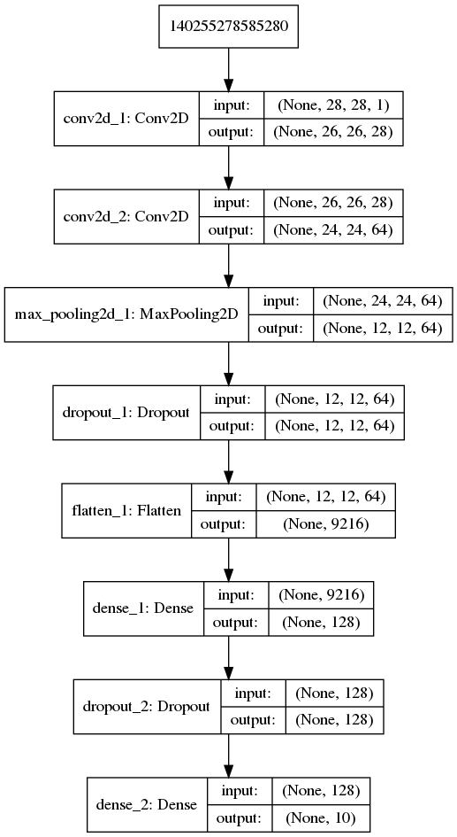
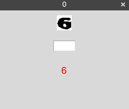

For educational purposes only, use at your own responsibility.

# HUJI-Captcha
This is my attempt at cracking the CAPTCHA generated by HUJI. The challenge here is that sometimes the digits cannot be easily separated and sometimes they have a line drawn over them making it a harder task.

The following example shows how a number like zero may look differently in the same captcha due to the random line that is added.

# CNN Architecture

# Online Learning
Allows you to see the CNN work in action, it starts a simple GUI that shows a digit and the CNN prediction (as shown below). Every 32 digits a batch is sent for the CNN to use for learning which improves the model's accuracy.

If the prediction is correct you can simple press enter to see another digit, otherwise, your input is used as the correct label and is passed to the CNN when it receives its next learning batch.

Whenever a learning batch is used for learning, a copy of the new model is dumped into model_dump folder and the last dumped model is used the next time the GUI is launched.

Images that are classified in the process are moved to classified_digits/i where i is the digit in the image.

# Offline Learning
Allows to perform experimentation on the classifed images.

# Captcha Util
Allows downloading HUJI captchas and extracting the digits easily.
The extraction is done by removing as much white space as possible from the sides, and then splitting it to five even images.

# Results
After classifying 9757 digits, the model reached a 99.36% accuracy on the training data and 99.18% accuracy on the evaluation data where 70% of the digits were used for training.
